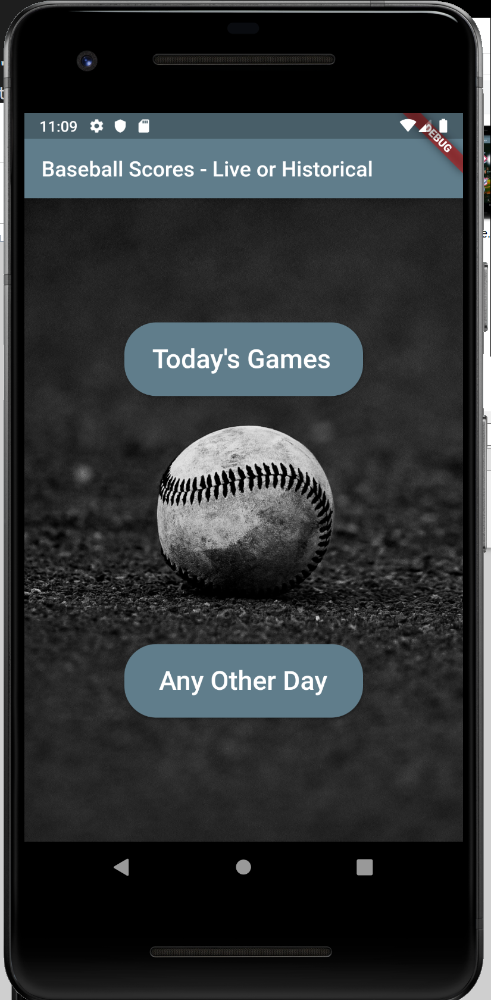
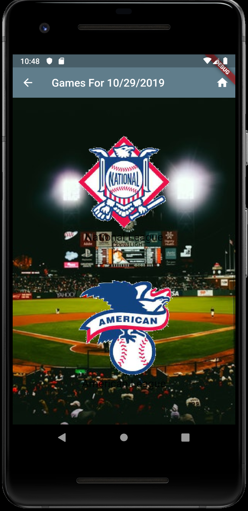

# odds

This is a Flutter app that displays real time (ok, delayed 10 minutes) box scores of today's Major League Baseball games. This app is tested on Android only for now, although it can be built for IOS. 

The app is a Flutter material app. It uses flutter_bloc as the state management framework. It is 'semi' adaptive to device size. That needs more work to accomodate most device sizes. 

The live data is fetched from [MySportsFeeds.com](https://mysportsfeeds.com). This service provides real time data feeds for Major League Baseball, National Hockey League and National Football League. Check it out.

The app shows the following screens:

## select_date - select a date

## select_league - select desired league

## Select a Game to View

  - all games active today are shown
  - 'Today' means local time today. rolls over to next day at midnight local time.
  - scroll as needed
  - select a game to view box score

## Box Score

  - live box score
  - matchup/odds TBD
  - pull down to update

